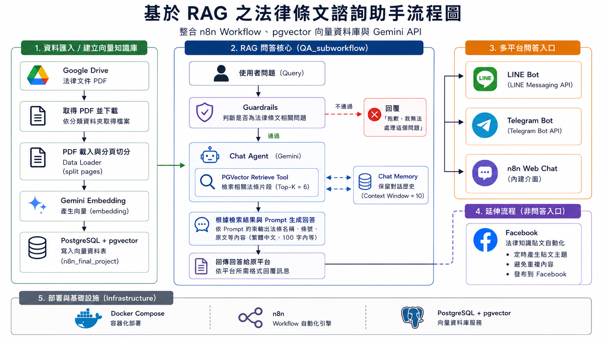

# 基於 RAG 之法律條文諮詢助手

以 n8n 為核心之法律 RAG Workflow 系統，整合 PostgreSQL/pgvector、Gemini API 與多平台聊天機器人流程，建立具檢索依據之法律問答與法律知識自動化系統。

---

# Project Goal

本專案旨在建立一套輕量化法律條文檢索與生成式問答系統，透過 RAG（Retrieval-Augmented Generation）架構，提供具檢索依據之法律問答流程。

系統整合：

- 法律文件檢索
- 向量資料庫搜尋
- AI 法律問答生成
- 多平台聊天機器人 Workflow
- 法律知識內容自動化

主要目標：

- 提升法律條文查詢效率
- 建立可重用之 AI Workflow
- 支援多平台法律問答入口
- 提升法律問答的檢索依據性與回答穩定性

---

# System Architecture



---

# Project Structure

```text
.
├── assets
│   └── system_architecture.png
│
├── n8n_workflows
│   ├── QA_subworkflow.json
│   ├── data_ingestion.json
│   ├── line_workflow.json
│   ├── telegram_workflow.json
│   ├── n8n_workflow.json
│   └── social_network.json
│
├── compose.yaml
├── .env.example
└── README.md
```

---

# Workflow Overview

## QA_subworkflow

核心 RAG 問答流程。

Features:

- Guardrails 法律問題範圍限制
- PGVector Retrieval Tool
- Chat Memory 對話記憶
- Gemini 回答生成

---

## data_ingestion

法律知識庫建立流程。

資料流程：

```text
Google Drive PDF
→ PDF Loader / split pages
→ Gemini Embedding
→ PostgreSQL + pgvector
```

用途：

- 從 Google Drive 取得法律 PDF
- 讀取並分頁切分文件
- 建立文件 embedding
- 寫入 PostgreSQL/pgvector 向量資料庫

---

## line_workflow / telegram_workflow / n8n_workflow

多平台聊天機器人入口。

所有平台共用同一套 QA_subworkflow：

```text
使用者訊息
→ QA_subworkflow
→ 回傳生成回答
```

支援平台：

- LINE Bot
- Telegram Bot
- n8n Web Chat

---

## social_network

法律知識社群內容自動化流程。

Features:

- 定時產生法律知識內容
- 重複內容檢查
- Facebook 自動發布

---

# Technologies

- n8n
- Gemini API
- PostgreSQL
- pgvector
- Docker Compose
- RAG（Retrieval-Augmented Generation）
- Prompt Engineering
- LINE Messaging API
- Telegram Bot API
- Facebook Graph API
